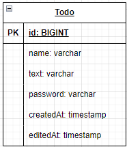

# **Todo API 명세서**

## **1. 일정 생성**
| **Method** | **URL**  | **Request Body**                                                                                                                                                                                                                  | **Response**                                                                                                                                             | **Status**                           |
|------------|----------|-----------------------------------------------------------------------------------------------------------------------------------------------------------------------------------------------------------------------------------|----------------------------------------------------------------------------------------------------------------------------------------------------------|--------------------------------------|
| `POST`     | `/todos` | ```json { ```<br/> ```"text": "String 할 일",```<br/> ``` "name": "String 작성자 이름", ```<br/> ``` "password": "String 비밀번호", ```<br/> ```"createdAt": "LocalDateTime 일정 생성 시간", ```<br/> ```"editedAt": "LocalDateTime 일정 수정 시간" }``` | 없음 | CREATED : 201<br/> BAD_REQUEST : 400 |

---

## **2. 전체 일정 조회**
| **Method** | **URL** | **Request Body** | **Response**               | **Status** |
|------------|---------|------------------|----------------------------|------------|
| `GET`      | `/todos` | -                | List\<ScheduleResponseDto> |-  |

---

## **3. 선택 일정 조회**
| **Method** | **URL** | **PathVariable** | **Request Body** | **Response** | **Status** |
|------------|---------|--------------------|------------------|--------------|------------|
| `GET`      | `/todos/{id}` | `id`: 조회할 일정의 ID | -                | ScheduleResponseDto | -          |

---

## **4. 선택 일정, 이름 수정**
| **Method** | **URL** | **PathVariable** | **Request Body** | **Response** | **Status** |
|------------|---------|--------------------|------------------|--------------|------------|
| `PATCH`    | `/todos/{id}` | `id`: 수정할 일정의 ID | ```json { "name": "String 수정된 작성자 이름" }``` | ScheduleResponseDto | -          |

---

## **5. 선택 일정 삭제**
| **Method** | **URL** | **PathVariable** | **Request Body** | **Response** | **Status** |
|------------|---------|-------------------|------------------|--------------|------------|
| `DELETE`   | `/todos/{id}` | `id`: 삭제할 일정의 ID | -                | -            | -          |


# **ERD**
